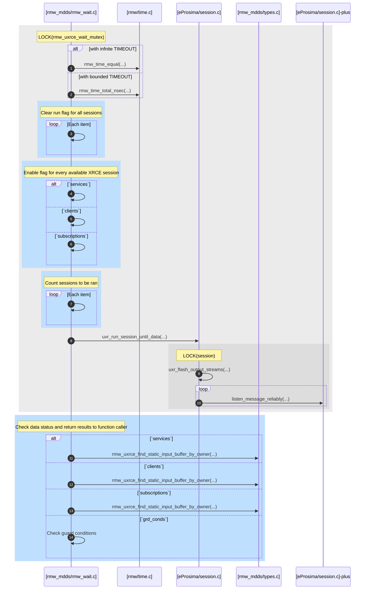

## wait_set()

### I. `rcl_wait()`

### II. `rmw_wait()`

```mermaid
sequenceDiagram
autonumber
	participant A as [rmw_mdds/rmw_wait.c]
	participant B as [rmw/time.c]
	participant C as [eProsima/session.c]
	participant D as [rmw_mdds/types.c]
	participant E as [eProsima/session.c]-plus
	
	
rect rgb(235, 235, 235)
Note over A: LOCK(rmw_uxrce_wait_mutex)
	alt with infnite TIMEOUT
		A->>B: rmw_time_equal(...)
	else with bounded TIMEOUT
		A->>B: rmw_time_total_nsec(...)
	end
	
	rect rgb(191, 223, 255)
	Note over A: Clear run flag for all sessions
		loop Each item
        A->>A: 
    end
	end
	rect rgb(191, 223, 255)
	Note over A: Enable flag for every available XRCE session
		alt `services`
			A->>A: 
		else `clients`
			A->>A: 
	  else `subscriptions`
	  	A->>A: 
		end
	end
	rect rgb(191, 223, 255)
	Note over A: Count sessions to be ran
		loop Each item
        A->>A: 
    end
	end
	
	A->>C: uxr_run_session_until_data(...)
	rect rgb(221, 221, 221)
	Note over C: LOCK(session)
		C->>C: uxr_flash_output_streams(...)
		loop 
    	C->>E: listen_message_reliably(...)	#//TODO: details expand
  	end
	end
end
	rect rgb(191, 223, 255)
	Note over A: Check data status and return results to function caller
		alt `services`
			A->>D: rmw_uxrce_find_static_input_buffer_by_owner(...)
		else `clients`
			A->>D: rmw_uxrce_find_static_input_buffer_by_owner(...)
	  else `subscriptions`
	  	A->>D: rmw_uxrce_find_static_input_buffer_by_owner(...)
	  else `grd_conds`
	  	A->>A: Check guard conditions
		end
	end
```

