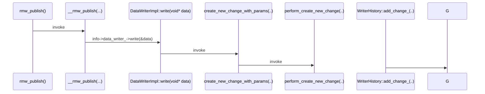
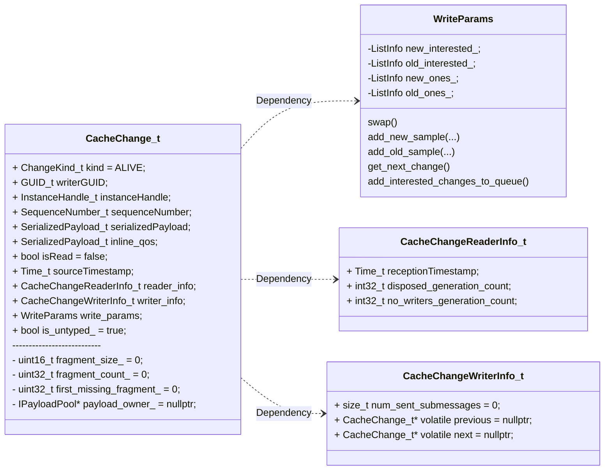
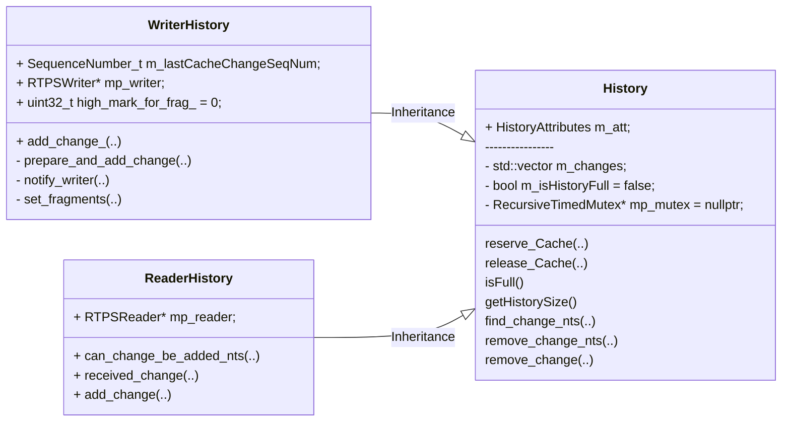
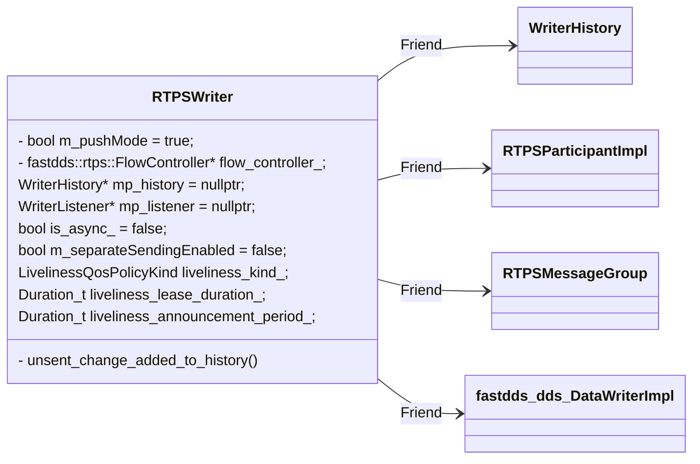
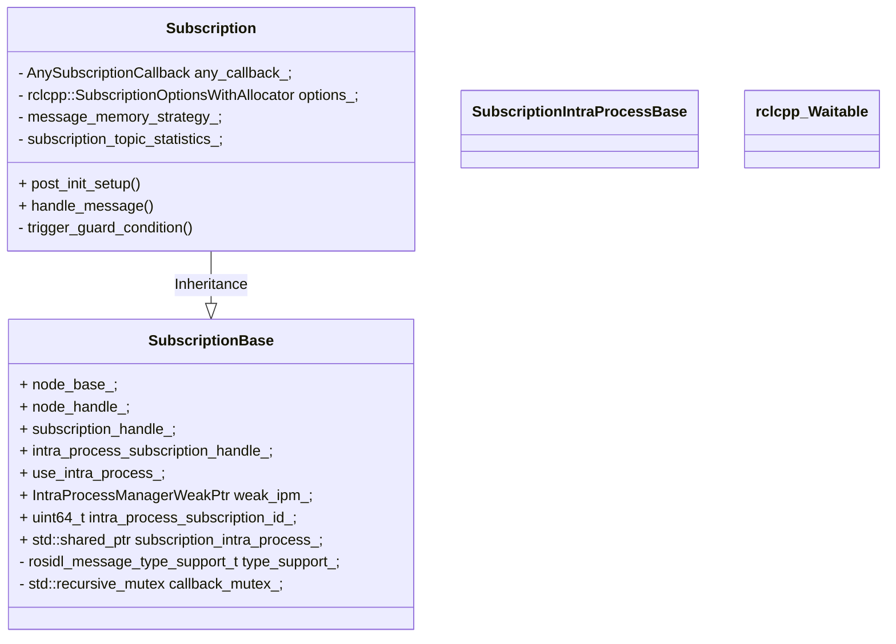

### 2. DDS Layer

### 2.1 Core

#### 2.1.1 Entity

**Entity** is the abstract base class for all the DDS entities, meaning an object that supports QoS policies, a listener, and statuses.

1. **Types of Entities**

   - **DomainParticipant**: This entity is the entry-point of the Service and acts as a factory for Publishers, Subscribers, and Topics.
   - **Publisher**: It acts as a factory that can create any number of *DataWriters*.
   - **Subscriber**: It acts as a factory that can create any number of *DataReaders*.
   - **Topic**: This entity fits between the publication and subscription entities and acts as a *channel*.
   - **DataWriter**: Is the object responsible for the data distribution.
   - **DataReader**: Is the object used to access the received data.

2. **Common Entity Characteristics**

   All entity types share some characteristics that are common to the concept of an entity. Those are:

   - **Entity Identifier**: Each entity is identified by a unique ID, which is shared between the DDS entity and its corresponding RTPS entity if it exists. That ID is stored on an Instance Handle object declared on Entity base class, which can be accessed using the getter function [`get_instance_handle()`](https://fast-dds.docs.eprosima.com/en/latest/fastdds/api_reference/dds_pim/core/entity.html#_CPPv4NK8eprosima7fastdds3dds6Entity19get_instance_handleEv).

   - **QoS policy**: *The behavior of each entity* can be configured with a set of configuration policies. *For each entity* type, there is a corresponding Quality of Service (QoS) class that groups all the policies that affect said entity type. Users can create instances of these QoS classes, modify the contained policies to their needs, and use them to configure the entities, either during their creation or at a later time with the `set_qos()` function that every entity exposes ([`DomainParticipant::set_qos()`](https://fast-dds.docs.eprosima.com/en/latest/fastdds/api_reference/dds_pim/domain/domainparticipant.html#_CPPv4NK8eprosima7fastdds3dds17DomainParticipant7set_qosERK20DomainParticipantQos), [`Publisher::set_qos()`](https://fast-dds.docs.eprosima.com/en/latest/fastdds/api_reference/dds_pim/publisher/publisher_class.html#_CPPv4N8eprosima7fastdds3dds9Publisher7set_qosERK12PublisherQos), [`Subscriber::set_qos()`](https://fast-dds.docs.eprosima.com/en/latest/fastdds/api_reference/dds_pim/subscriber/subscriber_class.html#_CPPv4N8eprosima7fastdds3dds10Subscriber7set_qosERK13SubscriberQos), [`Topic::set_qos()`](https://fast-dds.docs.eprosima.com/en/latest/fastdds/api_reference/dds_pim/topic/topic_class.html#_CPPv4N8eprosima7fastdds3dds5Topic7set_qosERK8TopicQos), [`DataWriter::set_qos()`](https://fast-dds.docs.eprosima.com/en/latest/fastdds/api_reference/dds_pim/publisher/datawriter.html#_CPPv4N8eprosima7fastdds3dds10DataWriter7set_qosERK13DataWriterQos), [`DataReader::set_qos()`](https://fast-dds.docs.eprosima.com/en/latest/fastdds/api_reference/dds_pim/subscriber/datareader.html#_CPPv4N8eprosima7fastdds3dds10DataReader7set_qosERK13DataReaderQos)).

   - **Listener**: **A listener is an object with functions that an entity will call in response to events**. Therefore, the listener acts as an *asynchronous notification system* that allows the entity to notify the application about the [Status](https://fast-dds.docs.eprosima.com/en/latest/fastdds/dds_layer/core/entity/entity.html#dds-layer-core-entity-commonchars-status) changes in the entity.

     > All entity types define an abstract listener interface, which contains the callback functions that the entity will trigger to communicate the [Status](https://fast-dds.docs.eprosima.com/en/latest/fastdds/dds_layer/core/entity/entity.html#dds-layer-core-entity-commonchars-status) changes to the application. Users can implement their own listeners inheriting from these interfaces and implementing the callbacks that are needed on their application. Then they can link these listeners to each entity, either during their creation or at a later time with the `set_listener()` function that every entity exposes ([`DomainParticipant::set_listener()`](https://fast-dds.docs.eprosima.com/en/latest/fastdds/api_reference/dds_pim/domain/domainparticipant.html#_CPPv4N8eprosima7fastdds3dds17DomainParticipant12set_listenerEP25DomainParticipantListener), [`Publisher::set_listener()`](https://fast-dds.docs.eprosima.com/en/latest/fastdds/api_reference/dds_pim/publisher/publisher_class.html#_CPPv4N8eprosima7fastdds3dds9Publisher12set_listenerEP17PublisherListener), [`Subscriber::set_listener()`](https://fast-dds.docs.eprosima.com/en/latest/fastdds/api_reference/dds_pim/subscriber/subscriber_class.html#_CPPv4N8eprosima7fastdds3dds10Subscriber12set_listenerEP18SubscriberListener), [`Topic::set_listener()`](https://fast-dds.docs.eprosima.com/en/latest/fastdds/api_reference/dds_pim/topic/topic_class.html#_CPPv4N8eprosima7fastdds3dds5Topic12set_listenerEP13TopicListenerRK10StatusMask), [`DataWriter::set_listener()`](https://fast-dds.docs.eprosima.com/en/latest/fastdds/api_reference/dds_pim/publisher/datawriter.html#_CPPv4N8eprosima7fastdds3dds10DataWriter12set_listenerEP18DataWriterListener), [`DataReader::set_listener()`](https://fast-dds.docs.eprosima.com/en/latest/fastdds/api_reference/dds_pim/subscriber/datareader.html#_CPPv4N8eprosima7fastdds3dds10DataReader12set_listenerEP18DataReaderListener)). The listener interfaces that each entity type and their callbacks are explained in the documentation for each entity type. When an event occurs it is handled by the lowest level entity with a listener that is non-null and has the corresponding callback enabled in its [`StatusMask`](https://fast-dds.docs.eprosima.com/en/latest/fastdds/api_reference/dds_pim/core/status/statusmask.html#_CPPv4N8eprosima7fastdds3dds10StatusMaskE). Higher level listeners inherit from the lower level ones as shown in the [diagram](https://fast-dds.docs.eprosima.com/en/latest/_images/listeners_inheritance_diagram.svg).

   - **Status**: Each entity is associated with a set of status objects whose values represent the *communication status* of that entity. The changes on these status values are the ones that trigger the invocation of the appropriate Listener callback to asynchronously inform the application. 

   - **StatusCondition**: Every entity owns a StatusCondition that will be notified whenever its enabled statuses change. The StatusCondition provides the link between an Entity and a Wait-set. 

   > More information can be found [here](https://fast-dds.docs.eprosima.com/en/latest/fastdds/dds_layer/core/entity/entity.html).

#### 2.1.2 Policy

The Quality of Service (QoS) is used to specify the behavior of the Service, allowing the user to define how each entity will behave. To increase the flexibility of the system, the QoS is decomposed in several QoS Policies that can be configured independently. However, there may be cases where several policies conflict. Those conflicts are notified to the user through the ReturnCodes that the QoS setter functions returns.

Each Qos Policy has a unique ID defined in the [`QosPolicyId_t`](https://fast-dds.docs.eprosima.com/en/latest/fastdds/api_reference/dds_pim/core/policy/qospolicyid_t.html#_CPPv4N8eprosima7fastdds3dds13QosPolicyId_tE) enumerator. This ID is used in some [Status](https://fast-dds.docs.eprosima.com/en/latest/fastdds/dds_layer/core/status/status.html#dds-layer-core-status) instances to identify the specific Qos Policy to which the Status refers.

There are QoS Policies that are immutable, which means that only can be specified either at the entity creation or before calling the enable operation.

Each DDS Entity has a specific set of QoS Policies that can be a mix of Standard QoS Policies, XTypes Extensions and eProsima Extensions.

> More information can be found [here](https://fast-dds.docs.eprosima.com/en/latest/fastdds/dds_layer/core/policy/policy.html).

#### 2.1.3 Status

Each [Entity](https://fast-dds.docs.eprosima.com/en/latest/fastdds/dds_layer/core/entity/entity.html#dds-layer-core-entity) is associated with a set of `Status` objects whose values represent the *communication status* of that Entity. Changes on the status values occur due to communication events related to each of the entities, e.g., when new data arrives, a new participant is discovered, or a remote endpoint is lost. The status is decomposed into several status objects, each concerning a different aspect of the communication, so that each of these status objects can vary independently of the others.

Changes on a status object trigger the corresponding [Listener](https://fast-dds.docs.eprosima.com/en/latest/fastdds/dds_layer/core/entity/entity.html#dds-layer-core-entity-commonchars-listener) callbacks that allow the Entity to inform the application about the event. For a given status object with name `fooStatus`, the entity listener interface defines a callback function `on_foo()` that will be called when the status changes. 

#### 2.1.4 Conditions and Wait-sets

Conditions (in conjunction with wait-sets) provide an alternative mechanism to allow the middleware to notify communication status changes (including arrival of data) to the application. 

> More information can be found [here](https://fast-dds.docs.eprosima.com/en/latest/fastdds/dds_layer/core/waitsets/waitsets.html).


### 1. FastDDS

1. `unsent_change_added_to_history(*change, &blocking_time)`

   ```mermaid
   sequenceDiagram
   	participant A as A
   	participant B as B
   	participant C as C
   	participant D as D
   	participant E as E
   	participant F as F
   	participant G as G
   	
   	A->>B: rclcpp::create_subscription()
   	rect rgb(175, 255, 212)
   		B->>D: SubscriptionIntraProcess()
   		D->>E: create_intra_process_buffer()
   		E->>F: RingBufferImplementation()
   		E->>F: TypedIntraProcessBuffer()
   		D->>G: rcl_guard_condition_init()
   		G-->>B: RETURN
   	end
   	
   	rect rgb(187, 213, 259)
   		B->>+C: IPM::add_subscription()
   		loop add sub_id to all matchable pubs
   			C->>C: insert_sub_id_for_pub()
   		end
   		C-->>B: RETURN
   	end
   	
   	rect rgb(255, 251, 221)
   		B->>D: SubscriptionBase::setup_intra_process()
   		D-->>B: RETURN
   	end
   	
   	%%Note over B: [DIR: rclcpp]
   	%%Note over D: [DIR: rclcpp/experimental]
   	%%Note over E: [DIR: rclcpp/experimental]
   	%%Note over F: [DIR: rclcpp/experimental/buffers]
   ```

   ```mermaid
   flowchart TD
   	subgraph loop_async_mode.running?
   		A[Start] --> B{async_mode.writers_interested_in_remove?}
   		B -- False --> C
   	end
   ```

   ### :book:1. Folder `rtps/flowcontrol`

   > rtps/flowcontrol
   >
   > | FlowController.hpp
   >
   > | FlowControllerConsts.cpp
   >
   > | FlowControllerFactory.cpp
   >
   > | FlowControllerFactory.hpp
   >
   > | FlowControllerImpl.hpp
   >
   > | ThroughputControllerDescriptor.cpp

   1. FlowControllerImpl.hpp||`run()`: Function run by the asynchronous thread.

      ```mermaid
      sequenceDiagram
      	participant A as run( )
      	participant B as run( )
      
      	loop async_mode.running=true
      		alt async_mode.writers_interested_in_remove = false
      			A->>+B: lock(mutex_)
      			A->>B: in_lock(async_mode.changes_interested_mutex)
      			A->>B: sched.add_interested_changes_to_queue_nts()
      			loop busy waiting
      				A->>B: async_mode.wait(in_lock)
      				A->>B: sched.add_interested_changes_to_queue_nts()
      			end
      			B-->>-A: 
      		end
      	end
      	
      
      	%%Note over B: [DIR: rclcpp]
      	%%Note over D: [DIR: rclcpp/experimental]
      	%%Note over E: [DIR: rclcpp/experimental]
      	%%Note over F: [DIR: rclcpp/experimental/buffers]
      ```

      > - `async_mode.writers_interested_in_remove`: 
      >
      > - Structure of Class `FlowControllerImpl`:
      >
      >   ```mermaid
      >   classDiagram 
      >   	FlowControllerImpl --|> FlowController : Inheritance
      >   	class FlowControllerImpl{
      >       -std::mutex mutex_;
      >       -fastrtps::rtps::RTPSParticipantImpl* participant_;
      >       -std::map writers_;
      >       -scheduler sched;
      >       -publish_mode async_mode;
      >       draw()
      >       draw()
      >   	}
      >   ```
      >
      >   
      >
      > - 11

      

      > TODO:
      >
      > - asynchronous thread一个writer一个？
      >
      > - `PublishMode` used to specify FlowController's publication model, FastDDS中定义了4种`PublishMode`：
      >
      >   1. `FlowControllerPureSyncPublishMode`: Only sends new samples synchronously. There is no mechanism to send old ones. 未实现
      >
      >   2. `FlowControllerAsyncPublishMode`: Sends new samples asynchronously. Old samples are sent also asynchronously.
      >
      >      ```mermaid
      >      classDiagram 
      >      	direction LR
      >      	class FlowControllerAsyncPublishMode{
      >          +std::thread thread;
      >          +bool running;
      >          +std::condition_variable cv;
      >          /// Mutex for interested samples to be added.
      >          +fastrtps::rtps::RTPSMessageGroup group;
      >          /// Used to warning async thread a writer wants to remove a sample.
      >          +std::mutex changes_interested_mutex;
      >          
      >          fast_check_is_there_slot_for_change()
      >          wait(std::unique_lock<std::mutex>& lock)
      >          force_wait()
      >      	}
      >      ```
      >
      >   3. `FlowControllerSyncPublishMode`: Sends new samples synchronously. Old samples are sent asynchronously
      >
      >   4. `FlowControllerLimitedAsyncPublishMode`: Sends all samples asynchronously but with bandwidth limitation.
      >
      >      ```mermaid
      >      classDiagram 
      >      	direction LR
      >      	FlowControllerLimitedAsyncPublishMode --|> FlowControllerAsyncPublishMode : Inheritance
      >      	class FlowControllerLimitedAsyncPublishMode{
      >      		+int32_t max_bytes_per_period;
      >      		+std::chrono::milliseconds period_ms;
      >      		-bool force_wait_;
      >      		-std::chrono::steady_clock::time_point last_period_;
      >      	}
      >           
      >      	class FlowControllerAsyncPublishMode{
      >          +std::thread thread;
      >          +bool running;
      >          +std::condition_variable cv;
      >          /// Mutex for interested samples to be added.
      >          +fastrtps::rtps::RTPSMessageGroup group;
      >          /// Used to warning async thread a writer wants to remove a sample.
      >          +std::mutex changes_interested_mutex;
      >               
      >          fast_check_is_there_slot_for_change()
      >          wait(std::unique_lock<std::mutex>& lock)
      >          force_wait()
      >      	}
      >      ```
      >
      >      
      >
      > - `SampleScheduling` used to specify FlowController's sample scheduling strategy, FastDDS中定义了4种调度策略：
      >
      >   1. **Fifo scheduling** `FlowControllerFifoSchedule`:
      >
      >      > //! Scheduler queue. FIFO scheduler only has one queue.
      >
      >      ```mermaid
      >      classDiagram 
      >      	direction LR
      >      	FlowControllerFifoSchedule ..> FlowQueue: Dependency
      >      	FlowQueue ..> ListInfo: Dependency
      >      	class FlowControllerFifoSchedule{
      >      		-FlowQueue queue_;
      >           
      >          register_writer()
      >          unregister_writer()
      >          add_new_sample(...)
      >          add_old_sample(...)
      >          get_next_change_nts()
      >          add_interested_changes_to_queue_nts()
      >      	}
      >      	     
      >      	class FlowQueue{
      >      		-ListInfo new_interested_;
      >      		-ListInfo old_interested_;
      >      		-ListInfo new_ones_;
      >      		-ListInfo old_ones_;
      >               
      >          swap()
      >          add_new_sample(...)
      >          add_old_sample(...)
      >          get_next_change()
      >          add_interested_changes_to_queue()
      >      	}
      >      	     
      >      	class ListInfo{
      >      		+fastrtps::rtps::CacheChange_t head;
      >      		+fastrtps::rtps::CacheChange_t tail;
      >      		     
      >      		add_change(...)
      >      		add_list(...)
      >      	}
      >      ```
      >
      >      
      >
      >   2. **Round Robin scheduling** `FlowControllerRoundRobinSchedule`:
      >
      >   3. **High priority scheduling** `FlowControllerHighPrioritySchedule`:
      >
      >   4. **Priority with reservation scheduling** `FlowControllerPriorityWithReservationSchedule`:
      >
      >   
      >
      > - 

   2. 111


### C++ lock

1. `std::unique_lock`


### `RMW_PUBLISH`

> - `prepare_and_add_change()`[eProsima/Fast-DDS/src/cpp/rtps/history/WriterHistory.cpp]：将一个新的change加入到history序列`m_changes`中；
> - 



## Structures

### I. `CacheChange_t` in [FILE:eProsima/Fast-DDS/include/fastdds/rtps/common/CacheChange.h]

> `CacheChange_t`是一个数据包change，包含了产生这个数据的writer，以及谁会使用这个数据？？？？




### II. History

> - `History`[FILE: eProsima/Fast-DDS/include/fastdds/rtps/history/History.h]
> - `WriterHistory`[FILE: eProsima/Fast-DDS/include/fastdds/rtps/history/WriterHistory.h]
> - `ReaderHistory`[FILE: eProsima/Fast-DDS/include/fastdds/rtps/history/ReaderHistory.h]
>
> `History`是一个以vector结构组织起来的`CacheChange_t`序列



> History:
>
> - `reserve_Cache()`: Reserve a CacheChange_t from the CacheChange pool.
> - `release_Cache()`: release a previously reserved CacheChange_t.
> - `find_change_nts()`: Find a specific change in the history using the matches_change method criteria.
> - `remove_change()`: Remove a specific change from the history.
>
> WriterHistory:
>
> - `add_change_()`: Introduce a change into the history, and let the associated writer send it.
>
>   ```mermaid
>   flowchart 
>   	subgraph GET guard_lock *mp_mutex
>   		A[START] --> B[prepare_and_add_change]
>   		B --> C[notify_writer]
>   		C --> D[END]
>   	end
>   ```
>
> - `add_change_with_commit_hook`: 
>
> - `prepare_and_add_change`: The change to be added.
>
> - `notify_writer()`: Notifies the RTPS writer associated with this history that a change has been added. Depending on the publish mode, it will be directly sent to the wire, or put into a sending queue.
>
>   ```mermaid
>   flowchart LR
>   	A[START] --> B[RTPSWriter::unsent_change_added_to_history]
>   	B --> C[END]
>   ```
>
>   

### III. `RTPSWriter`

A domain contains any number of **RTPSParticipants**, that is, elements capable of sending and receiving data. To do this, the **RTPSParticipants** use their **Endpoints**:

- **RTPSWriter**: Endpoint able to send data
- **RTPSReader**: Endpoint able to receive data

A RTPSParticipant can have any number of writer and reader endpoints. Communication revolves around **Topics**, which define and label the data being exchanged. The topics do not belong to a specific participant. The participant, through the **RTPSWriters**, makes changes in the data published under a topic, and through the **RTPSReaders** receives the data associated with the topics to which it subscribes. The communication unit is called **Change**, which represents an update in the data that is written under a Topic. **RTPSReaders**/**RTPSWriters** register these changes on their History, a data structure that serves as a cache for recent changes.

In the default configuration of eProsima FastDDS, when you publish a change through a **RTPSWriter** endpoint, the following steps happen behind the scenes:

1. The **change** is added to the **RTPSWriter**’s history cache
2. The **RTPSWriter** sends the change to any **RTPSReaders** it knows about in a sync/async way
3. After receiving data, **RTPSReaders** update their history cache with the new change



> 1. `unsent_change_added_to_history(..)`: Add a change to the unsent list.
>
>    - [FILE: eProsima/Fast-DDS/src/cpp/rtps/writer/StatefulWriter.cpp]
>
>      ```mermaid
>      flowchart 
>      	subgraph GET guard_lock mp_mutex
>      		A[START] --> B[check liveliness_lease_duration_?]
>      		B --> C[prepare metadata for datasharing]
>      		C --> D[Check other readers ?????????]
>      		D --> E[flow_controller_->add_new_sample]
>      		E --> F[END]
>      	end
>      ```
>
>      `add_new_sample()`: tries to send the sample synchronously or asynchronously. 同步发送则调用函数`deliver_sample_nts()`，异步发送则调用函数`enqueue_new_sample_impl()`。
>
>      ```c
>      // -异步发送
>      bool enqueue_new_sample_impl(
>                  fastrtps::rtps::RTPSWriter* writer,
>                  fastrtps::rtps::CacheChange_t* change,
>                  & max_blocking_time) {
>      	// Try to store for asynchronous delivery.
>      	std::unique_lock<std::mutex> lock(async_mode.changes_interested_mutex);
>      	sched.add_new_sample(writer, change);
>      	async_mode.cv.notify_one();
>      
>      	return true;
>      }
>      ```
>
>      ```c
>      // -同步发送
>      bool add_new_sample_impl(
>                  fastrtps::rtps::RTPSWriter* writer,
>                  fastrtps::rtps::CacheChange_t* change,
>                  & max_blocking_time){
>      	// This call should be made with writer's mutex locked.
>      	fastrtps::rtps::LocatorSelectorSender& locator_selector = writer->get_general_locator_selector();
>      	std::lock_guard<fastrtps::rtps::LocatorSelectorSender> lock(locator_selector);
>      	fastrtps::rtps::RTPSMessageGroup group(participant_, writer, &locator_selector);
>      	if (fastrtps::rtps::DeliveryRetCode::DELIVERED != writer->deliver_sample_nts(change, group, locator_selector, max_blocking_time)) {
>      	return enqueue_new_sample_impl(writer, change, max_blocking_time);
>      	}
>      
>      	return true;
>      }
>      ```
>
>    - [FILE: eProsima/Fast-DDS/src/cpp/rtps/writer/StatelessWriter.cpp]
>
> 2. 1


# ROS2 intra-comm


## test1

```mermaid
classDiagram 
	direction lr
	SubscriptionIntraProcessBuffer --|> SubscriptionROSMsgIntraProcessBuffer : Inheritance
	SubscriptionROSMsgIntraProcessBuffer --|> SubscriptionIntraProcessBase : Inheritance
	SubscriptionIntraProcessBase --|> rclcpp_Waitable : Inheritance
	SubscriptionIntraProcessBase --|> rclcpp_GuardCondition : used
	
	%%=================================================
	class SubscriptionIntraProcessBuffer{
		- BufferUniquePtr buffer_;
		- SubscribedTypeAllocator subscribed_type_allocator_;
		- SubscribedTypeDeleter subscribed_type_deleter_;
		
		+ provide_intra_process_message()
		+ provide_intra_process_data()
		- trigger_guard_condition()
	}
	
	%%=================================================
	class SubscriptionROSMsgIntraProcessBuffer{
		+ provide_intra_process_message()
	}
	
	%%=================================================
	class SubscriptionIntraProcessBase{
		+int32_t max_bytes_per_period;
		+std::chrono::milliseconds period_ms;
		--------------------------------------------
		- std::recursive_mutex callback_mutex_;
		- std::function<void(size_t)> on_new_message_callback_ [nullptr];
		- size_t unread_count_ [0];
		- rclcpp::GuardCondition gc_;
		- std::string topic_name_;
		- QoS qos_profile_;
		
		- trigger_guard_condition()
		- invoke_on_new_message()
	}

	%%=================================================
	class rclcpp_Waitable{

	}
```


# subscription

## test1





