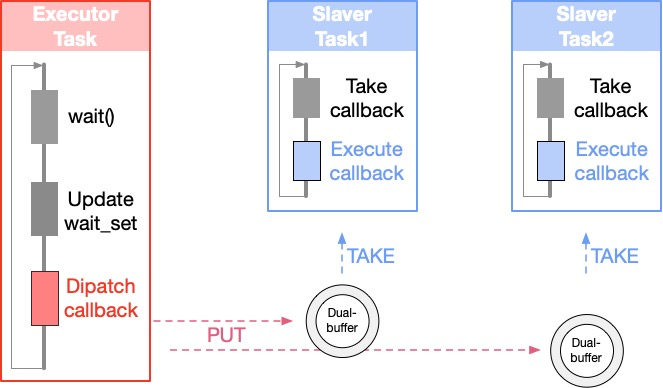
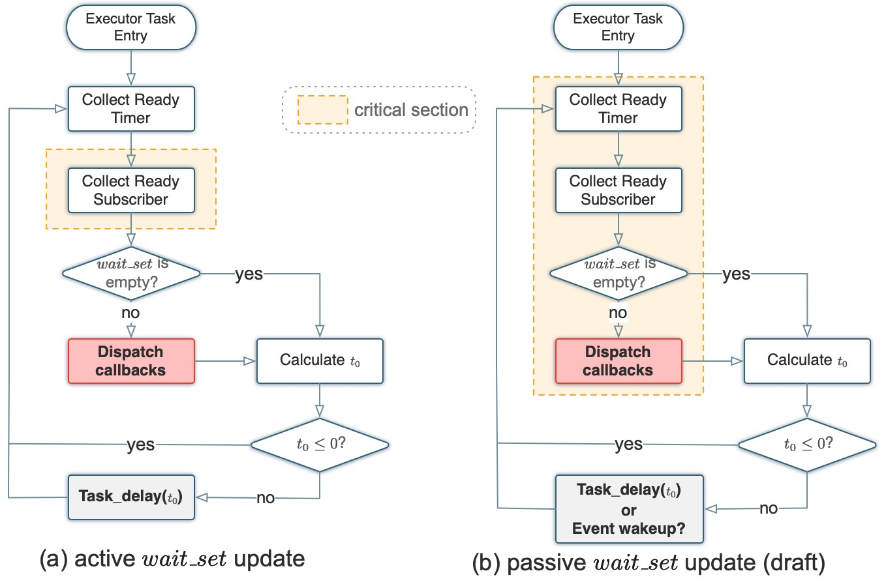
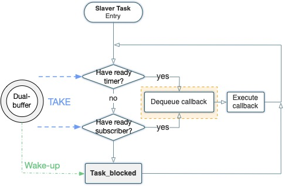
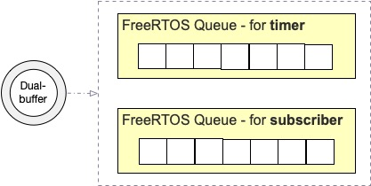

# neuROS
Prototype Real-time Operating System for [UPDATE]() based on [micro-ROS project](https://micro.ros.org/)

## Design Goals
1. **Workload management:** mapping event-based execution model in micro-ROS to fixed periodic scheduling scheme( in AUTOSAR) or server-based scheduling
1. **DDS resource management:** DDS and network communication should be wrapped in a RTOS thread
1. **Event-trigger method:** OS manages event trigger logic through *OS Event Manager*
1. **Intra/Inter Process Communication:** Middleware should be able to choose intra-process, inter-process or remote-process communication automatically
1. **Low overhead DDS:** use embeddedRTPS to replace XRCE-DDS, so that the microcontroller can act as a master node in the DDS network
1. Reuse ROS2 and Posix-like API as much as possible

## Background
### A. Basic Concepts
1. **Callback**: is the minimal schedulable workload in ROS2. There are 5 types of callbacks in ROS2: timer, subscription, client, service and waitable callbacks. In this work, we only focus on the support of timer and subscription callbacks, and leave the other functionality support to future work. As mentioned before, a timer callback arrives periodically at a predefined rate, while subscription callbacks follow an event-triggered fashion.
2. **Node**: is a collection of callback functions, organized by application programmers for modularity and composability.
3. **Topic**: is used as a means of communication among different nodes. In ROS2, a node can publish its data to a topic, so that all nodes subscribed to that topic can receive the message. By default, ROS2 kernel provides two kinds of communication mechanisms. DDS provides both inter and intra-process communication. And the intra-process API which resides in ROS2 can provide more efficient intra-process communication.
4. **Chain**: 

### B. About micro-ROS
1. **Optimized client-library for ROS concepts on microcontrollers** The client-library of ROS 2 (rcl) includes the concepts of nodes, publishers/subscriptions, topics, client/service, node graph, lifecycle, actions, parameters etc. Micro-ROS brings all these core concepts onto microcontrollers along with the set of extensions and convenience functions (rclc) allowing implementation of common scheduling patterns from embedded systems. Together, rcl+rclc form a complete clientlibrary in micro-ROS.
2. **Flexible middleware, considering extremely resource-constraint environment** ROS 2 is implemented with DDS as it middleware. Micro-ROS comes with a new DDS for extremely resource-constraint environment, called Micro XRCE-DDS, implemented by eProsima, meeting all the necessary requirements for embedded systems. Micro XRCE-DDS follows a client-server architecture, in which Micro XRCE-DDS Client, running on resource-constraint embedded devices connects to Micro XRCE-DDS Agent, running on larger processors. The Agent is responsible to route the information from clients to DDS world and vice versa.
3. **Indefectible integration with ROS 2** As explained in the last key feature, micro-ROS nodes running on microcontrollers seamlessly connects to the external ROS 2 system with the help of micro-ROS Agent running on that system. As a result, with the known ROS 2 tools and APIs, micro-ROS nodes could be accessed just as normal ROS nodes.
4. **Support on any POSIX-compliant RTOS** Micro-ROS application can be built and ported on any RTOS such as FreeRTOS, NuttX, Zephyr with POSIX interface. In ROS 2 package, RTOS-specific tools are integrated with a few generic setup scripts that can be run through command line. During the firmware creation step, application developers can choose the RTOS and these scripts will build the framework.

## Design of neuROS
### A. Overview

#### 1. `Executor Task` - (the highest priority)
A `Executor Task` is responsible for **collecting the ready callbacks** periodically and **dispatching callbacks** to other `Slaver Task`s. So those functionalities should be designed in detail:
- **$Wait\_{set}$ update strategy**:
- **Callback dispatching policy**:

#### 2. `Slaver Task` - (a lower priority)
A `Slaver Task` is used to fetch ready callback from `Dual-buffer` with respect to callback priority and execute the corresponding callback function.
- **Callback fetching policy**:

#### 3. `Dual-buffer`
Each `Slaver Task` has a `Dual-buffer`, which is responsible for recording the dispatched callbacks to this `Slaver Task`. Specifically, a `Dual-buffer` consists of two FIFO buffers, one for Timer callbacks and the other for Subscription callbacks.

#### 4. An Example
1.设置两条任务链，每条任务链包含一个Timer和两个Subscription，手动为Timer或Subscription对应的callback绑定优先级，设置任务链一内callback的优先级不高于10，任务链二内callback的优先级不低于10，示意图如下：

2.一共两个SlaverTask，设置Task2的优先级高于Task1，Task1处理优先级不高于10的callback，Task2处理优先级不低于10的callback。
3.利用FreeRTOS的队列机制，一个SlaverTask对应一个Dual-buffer，Dual-buffer中包含两个队列，一个队列存储Timer_callback，一个队列存储Subscription_callback，SlaverTask的每次循环，先看timer_queue是否为空，再看subscription_queue是否为空，如果两个队列都为空，则将自身挂起，ExecutorTask每次分发任务时会对SlaverTask进行判断，如果SlaverTask为挂起态，ExecutorTask会将SlaverTask设置为执行态。
4.运行结果如下： 

### B. Design of `Executor Task`

- **$Wait\_{set}$ update strategy**: Active $Wait\_{set}$ update is the same with micro-ROS.
- **Callback dispatching policy**: Simply put callbacks into different slaver tasks with different priority.

### C. Design of `Slaver Task`

### D. Design of `Dual-buffer`

> **Timer buffer**: high priority -> check first
**Subscriber buffer**: low priority

> **Limitation of Current Implementation:** priority in each callback class is not supported. So for each buffer, enqueue and dequeue are both FIFO.

### E. Design of `Ring buffer` for each publisher/subscriber
> Zilong: add contents here.

## Implementation of neuROS
TODO

## Setup and Build
### A. Supported platforms

| RTOS     | Platform                                                     | Version            | Example                  | Others                                                       |
| -------- | ------------------------------------------------------------ | ------------------ | ------------------------ | ------------------------------------------------------------ |
| FreeRTOS | [ST Nucleo F446ZE](https://www.st.com/en/evaluation-tools/nucleo-f446ze.html) | STM32CubeMX latest | `freertos nucleo_f446ze` | **[micro-ROS utils for STM32CubeMX and STM32CubeIDE](https://github.com/micro-ROS/micro_ros_stm32cubemx_utils)** |

### B. Building

1. [First micro-ROS Application on FreeRTOS](https://micro.ros.org/docs/tutorials/core/first_application_rtos/freertos/)
2. [micro_ros_setup](https://github.com/micro-ROS/micro_ros_setup)

---
