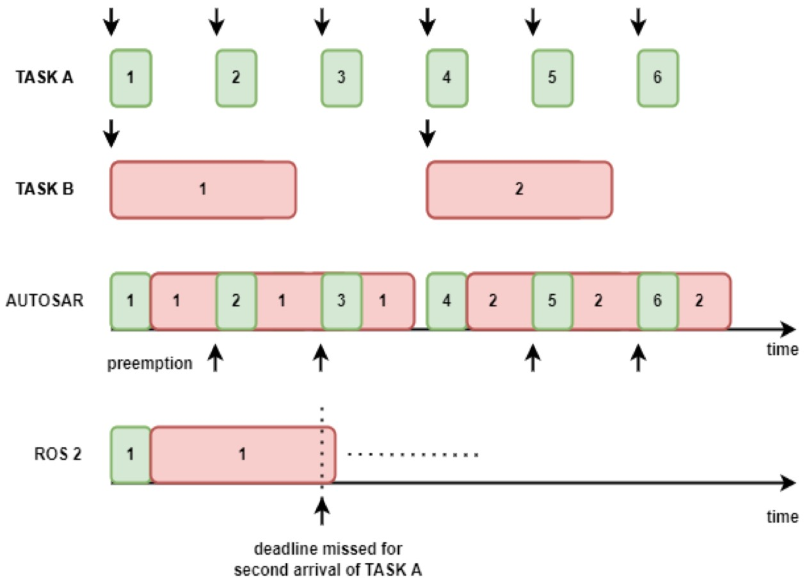
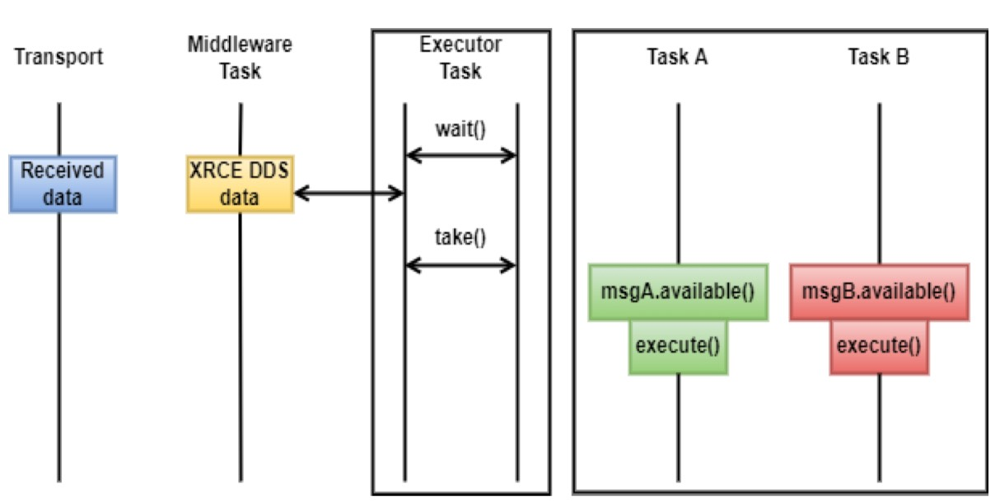

# neuROS
Prototype Real-time Operating System for [UPDATE]() based on [micro-ROS project](https://micro.ros.org/)

## TODO List

- [ ] |0726/To liu|-> execution design|: add an example to show current callback execution logic
- [ ] |0726/To liu|-> execution design|: explain neuROS execution logic in detail
- [ ] |0726/To liu|-> execution design|: detail code implementaion plan and test method

## Design Goals
1. **Workload management:** mapping event-based execution model in micro-ROS to fixed periodic scheduling scheme( in AUTOSAR) or server-based scheduling
1. **DDS resource management:** DDS and network communication should be wrapped in a RTOS thread
1. **Event-trigger method:** OS manages event trigger logic through *OS Event Manager*
1. **Intra/Inter Process Communication:** Middleware should be able to choose intra-process, inter-process or remote-process communication automatically
1. **Low overhead DDS:** use embeddedRTPS to replace XRCE-DDS, so that the microcontroller can act as a master node in the DDS network
1. Reuse ROS2 and Posix-like API as much as possible

## Design Proposals
### a. Starting from micro-ROS
- **Optimized client-library for ROS concepts on microcontrollers** The client-library of ROS 2 (rcl) includes the concepts of nodes, publishers/subscriptions, topics, client/service, node graph, lifecycle, actions, parameters etc. Micro-ROS brings all these core concepts onto microcontrollers along with the set of extensions and convenience functions (rclc) allowing implementation of common scheduling patterns from embedded systems. Together, rcl+rclc form a complete clientlibrary in micro-ROS.
- **Flexible middleware, considering extremely resource-constraint environment** ROS 2 is implemented with DDS as it middleware. Micro-ROS comes with a new DDS for extremely resource-constraint environment, called Micro XRCE-DDS, implemented by eProsima, meeting all the necessary requirements for embedded systems. Micro XRCE-DDS follows a client-server architecture, in which Micro XRCE-DDS Client, running on resource-constraint embedded devices connects to Micro XRCE-DDS Agent, running on larger processors. The Agent is responsible to route the information from clients to DDS world and vice versa.
- **Indefectible integration with ROS 2** As explained in the last key feature, micro-ROS nodes running on microcontrollers seamlessly connects to the external ROS 2 system with the help of micro-ROS Agent running on that system. As a result, with the known ROS 2 tools and APIs, micro-ROS nodes could be accessed just as normal ROS nodes.
- **Support on any POSIX-compliant RTOS** Micro-ROS application can be built and ported on any RTOS such as FreeRTOS, NuttX, Zephyr with POSIX interface. In ROS 2 package, RTOS-specific tools are integrated with a few generic setup scripts that can be run through command line. During the firmware creation step, application developers can choose the RTOS and these scripts will build the framework.

### b. Design of neuROS

Comparison of Execution Management:

Execution Management mapped to fixed periodic scheduling scheme:

The data is received via the defined transport interrupt service routine. The middleware function running in a high-frequency task unpacks the data into XRCE DDS message. The executor function running in the same or slightly lower frequency task takes the incoming XRCE DDS message and will make it available for the corresponding callback. The callback function is not invoked immediately, but is executed in tasks often at lower frequency than executor. Therefore, from the application perspective, it must be ensured that these functions run into completion within the respective assigned period.

## Road map

1. execution mapping
2. DDS communication thread
3. Callback trigger logic based on *OS Event Manager*
4. embeddedRTPS porting
5. Inter/Intra/Remote process communication
6. Adapative communication selection

## Implementation
### a. Supported platforms

| RTOS     | Platform                                                     | Version            | Example                  | Others                                                       |
| -------- | ------------------------------------------------------------ | ------------------ | ------------------------ | ------------------------------------------------------------ |
| FreeRTOS | [ST Nucleo F446ZE](https://www.st.com/en/evaluation-tools/nucleo-f446ze.html) | STM32CubeMX latest | `freertos nucleo_f446ze` | **[micro-ROS utils for STM32CubeMX and STM32CubeIDE](https://github.com/micro-ROS/micro_ros_stm32cubemx_utils)** |

### b. Building

1. [First micro-ROS Application on FreeRTOS](https://micro.ros.org/docs/tutorials/core/first_application_rtos/freertos/)
2. [micro_ros_setup](https://github.com/micro-ROS/micro_ros_setup)

---